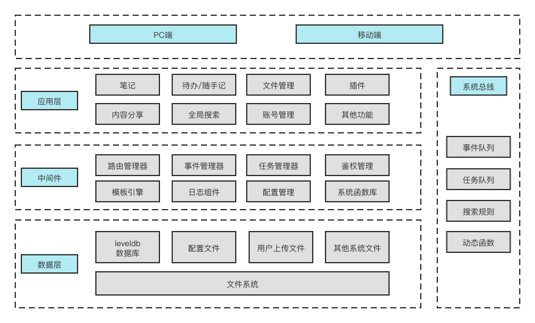

## 系统架构

### 层次架构




### 程序目录结构
```text
|-- app.py          # 程序入口
|-- core/
|   |-- xconfig.py      # 程序配置
|   |-- xmanager.py     # handlers管理器，负责模块加载，注册URL，以及定时任务触发
|   |-- xauth.py        # 权限控制
|   |-- xtables.py      # 数据库表结构
|   |-- xtemplate.py    # view层的渲染接口   
|   \-- autoreload.py   # 脚本变更热加载，主要用于调试，生产环境可以关闭
|
|-- xutils/         # 工具类集合
|-- lib/            # 第三方类库，程序启动时添加到sys.path中
|-- config/         # 系统配置目录
|   |-- file/       # 文件配置
|   |-- lang/       # 多语言配置
|   \-- template/   # 模板配置
|
|-- handlers/       # http请求处理器目录，功能实现大部分在这里
|   |-- api/        # 系统接口，返回JSON格式，供页面、定时任务、搜索调用
|   |-- system/     # 系统功能目录
|   |-- note/       # 笔记功能目录
|   |-- fs/         # 文件功能目录
|   |-- tools/      # 工具目录
|   |-- plugins/    # 插件目录
|   \-- ...         # 其他目录
|-- static/         # 静态文件
\-- tests/          # 测试用例

```

### 数据区目录结构

```

|-- files/     # 上传的文件
|   \-- user01 # 用户目录，以用户名作为目录名，支持多个
|       |-- upload   # 上传文件目录，上传文件以日期作为下级目录，比如 2019/01/
|       |-- gallery  # 相册文件
|
|-- backup/    # 备份目录
|-- scripts/   # 脚本目录
|-- storage/   # 应用存储目录
|-- db/        # 数据库目录
|-- log/       # 日志目录
|-- tmp/       # 临时文件
\-- trash/     # 回收站

```

## 开发框架/软件库

具体版本见`requirements.txt`

- webpy(修改版，xnote内置)
- tornado template(修改版，xnote内置)
- sqlite3 (Python自带文件型数据库)
- wsgidav 支持webdav的功能，用于挂载网络磁盘
- psutil(可选，采集系统运行数据)
- comtypes(可选，用于调用微软语音API)

## 前端依赖

- jquery JS基础库
- layer web弹层组件
- marked markdown解析器
- codemirror 代码编辑器
- jexcel web表格
- font-awesome 图标库
- art-template 模板引擎
- vue2 MVVM框架
- qrcode 二维码生成器
- csv.js 解析csv文件
- jsdiff 文本对比

## 新模块开发

在handlers目录下添加python程序，比如test.py

```py
class MyHandler:    
    def GET(self):
        return "success"

class Handler2:
    def GET(self):
        return "handler2"

# URL路由规则，支持多个配置
xurls = (
    r"/test", MyHandler,
    r"/handler2", Handler2
)

# 启动xnote，访问浏览器localhost:1234/test就会看到success
```
