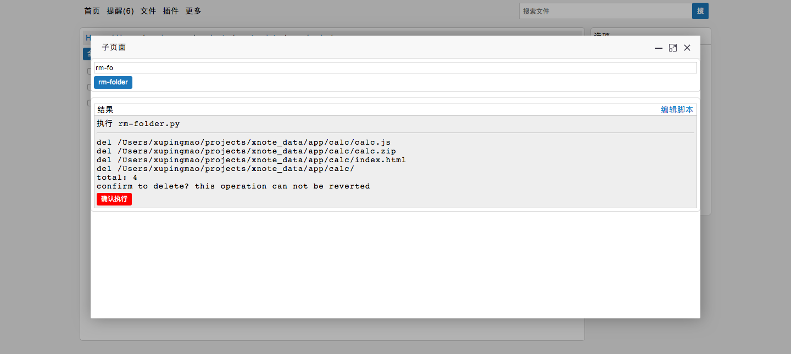

# 文件扩展脚本

> 本扩展方式已经不推荐使用

文件扩展脚本是用来扩展文件系统能力的，通过【文件】-> 【更多】可以进入文件扩展执行的页面，或者直接通过文件右侧的【更多】链接进入。文件扩展脚本主要用途是对文件进行分析处理，但是不限于此，你同样可以通过文件扩展脚本执行无关的命令，比如获取本机的ip信息等。扩展脚本的执行包括两个阶段，预览阶段和二次确认执行阶段，通过系统参数进行区分。

举个例子，我们可以通过文件插件实现`listdir`命令，它是不需要进行确认的，点击之后就立即打印出文件信息。


第二个例子是需要进行二次确认的，比如删除文件夹命令，点击扩展按钮时系统会打印出将要被删除的文件，但是不会立即删除，这个时候系统会询问是否执行，点击【确认执行】的按钮，系统将会删除所有的文件




# 脚本的编写

文件扩展是通过Python编写的脚本，目前定义了3个参数，选中的文件路径`path`，是否确认`confirmed`用于判断是否是用户确认之后请求，用户输入的参数`input`，提供一些控制能力。需要注意以下几点

- 注意扩展文件位置是```$data/scripts/commands```，这样进入执行页面的时候系统会列出所有可用的脚本
- 文件扩展和系统共享一个Python进程，所以可以共享系统API，但是同时也需要注意安全问题，否则可能导致系统崩溃。

下面是一个例子

```py
# encoding=utf-8
import xconfig
import xutils
import os
from xutils import unquote

'''清空回收站'''
def main(path=None, confirmed = False, **kw):
    for item in os.listdir(xconfig.TRASH_DIR):
        path = os.path.join(xconfig.TRASH_DIR, item)
        print('del %s' % unquote(path))
        if confirmed:
            try:
                os.remove(path)
            except:
                xutils.print_exc()
        if not confirmed:
            print('将永久删除以上文件，请确认')
        else:
            print('回收站清空完毕')
```


